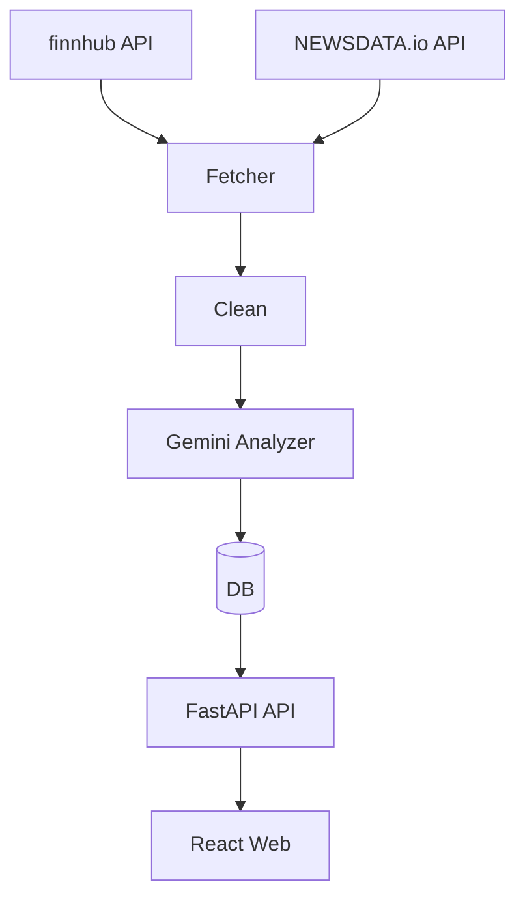
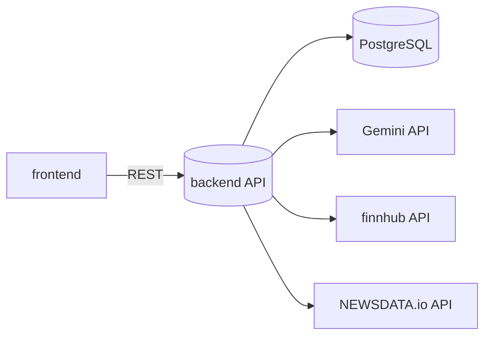

# Rokey News 요약/감성 분석 웹앱

finnhub와 NEWSDATA.io API를 통해 뉴스를 수집하고 Gemini로 요약/감성 분석하며, 웹에서 검색·필터링·열람할 수 있는 서비스입니다. 프런트(Vite+React)와 백엔드(FastAPI)로 구성됩니다.



## 기술 스택

### Backend
- **Framework**: FastAPI 0.115.0
- **Database**: SQLAlchemy 2.0.37 + PostgreSQL (psycopg 3.2.12)
- **Migration**: Alembic 1.14.0
- **AI**: Google Gemini API
- **News APIs**: finnhub, NEWSDATA.io

### Frontend
- **Framework**: React 18 + TypeScript
- **Build**: Vite
- **Routing**: React Router
- **Data Fetching**: TanStack Query (React Query)
- **Styling**: Tailwind CSS

### DevOps
- **CI/CD**: GitHub Actions
- **Deployment**: Render.com (Web Service + Static Site + PostgreSQL)
- **Testing**: pytest (Backend), ESLint (Frontend)

## 디렉터리 구조
- `backend/` FastAPI 서비스
- `frontend/` Vite+React 웹
- `docs/` 기획·설계 문서
- `.github/workflows/` CI/CD 파이프라인



## 배포 (Render.com) - 필독!

**이 프로젝트는 Render.com에서 환경 변수를 관리합니다.** 로컬 `.env` 파일은 개발용이며, 프로덕션 배포 시에는 Render.com 대시보드에서 환경 변수를 직접 설정합니다.

### 배포 아키텍처
- **Database**: PostgreSQL (Render Managed Database)
- **Backend**: Web Service (Python)
- **Frontend**: Static Site

### Render.com 환경 변수 설정

#### 1. Backend Web Service 환경 변수

Render Dashboard → Backend Web Service → **Environment** 탭에서 설정:

| 환경 변수 | 값 예시 | 설명 |
|---------|--------|-----|
| `GEMINI_API_KEY` | `AIza...` | [Google AI Studio](https://ai.google.dev/)에서 발급 |
| `FINNHUB_API_KEY` | `c...` | [finnhub](https://finnhub.io/)에서 발급 |
| `NEWSDATA_API_KEY` | `pub_...` | [NEWSDATA.io](https://newsdata.io/)에서 발급 |
| `DATABASE_URL` | `postgresql://...` | Render PostgreSQL의 **Internal Database URL** |
| `ALLOWED_ORIGINS` | `https://your-frontend.onrender.com` | 프론트엔드 도메인 (CORS) |
| `RATE_LIMIT_PER_MIN` | `60` | API 레이트 리밋 (선택) |

**중요**: 
- 환경 변수 추가/수정 후 **Save Changes** 클릭 시 자동으로 재배포됩니다
- `DATABASE_URL`은 반드시 Render PostgreSQL의 **Internal URL**을 사용하세요 (External URL 아님)
- `ALLOWED_ORIGINS`는 프론트엔드 배포 URL과 정확히 일치해야 합니다

#### 2. Frontend Static Site 환경 변수

Render Dashboard → Frontend Static Site → **Environment** 탭에서 설정:

| 환경 변수 | 값 예시 | 설명 |
|---------|--------|-----|
| `VITE_API_BASE_URL` | `https://your-backend.onrender.com` | 백엔드 Web Service URL |

**자세한 배포 가이드는 [`docs/deploy-guide.md`](docs/deploy-guide.md)를 참조하세요.**

## 빠른 시작 (로컬 개발)

### 필수 준비물

1. **API 키 발급**
   - [Google Gemini API](https://ai.google.dev/)
   - [finnhub API](https://finnhub.io/)
   - [NEWSDATA.io API](https://newsdata.io/)

### 백엔드 (로컬)

```bash
cd backend
python -m venv .venv && .venv/Scripts/activate   # Windows
# Linux/Mac: source .venv/bin/activate
pip install -r requirements.txt

# .env 파일 생성 (로컬 개발용)
cp .env.example .env
# .env 파일을 열어서 API 키 입력

uvicorn app.main:app --reload --host 0.0.0.0 --port 8000
```

- 헬스체크: http://localhost:8000/health
- API 문서: http://localhost:8000/docs

### 프런트엔드 (로컬)

```bash
cd frontend
npm install

# .env 파일 생성 (로컬 개발용)
echo "VITE_API_BASE_URL=http://localhost:8000" > .env

npm run dev
```

- 개발 서버: http://localhost:5173

### 로컬 환경 변수 설정 (개발용)

#### Backend (`backend/.env`)
```bash
# AI API (필수)
GEMINI_API_KEY=your_gemini_api_key_here

# News APIs (필수)
FINNHUB_API_KEY=your_finnhub_api_key_here
NEWSDATA_API_KEY=your_newsdata_api_key_here

# Database (로컬 개발: SQLite)
DATABASE_URL=sqlite:///./local.db

# CORS (로컬 프론트엔드)
ALLOWED_ORIGINS=http://localhost:5173

# Rate Limiting
RATE_LIMIT_PER_MIN=60
```

#### Frontend (`frontend/.env`)
```bash
VITE_API_BASE_URL=http://localhost:8000
```

**주의**: `.env` 파일은 로컬 개발용입니다. 프로덕션 배포 시에는 Render.com 대시보드에서 환경 변수를 설정하세요.

## 주요 기능

### 구현 완료
- ✅ finnhub & NEWSDATA.io API를 통한 뉴스 수집
- ✅ 중복 방지(해시 기반)
- ✅ Gemini 기반 요약/감성 분석/키워드 추출
- ✅ 기사 목록 조회 (검색, 감성 필터, 출처 필터, 날짜 필터, 정렬)
- ✅ 기사 상세 보기
- ✅ 감성 분석 결과 시각화 (긍정/중립/부정)
- ✅ CI/CD: GitHub Actions (lint, build, test, deploy)
- ✅ Render.com 배포 (PostgreSQL + Web Service + Static Site)

### 향후 개선 사항
- 📝 사용자 인증 및 권한 관리
- 📝 기사 북마크 및 즐겨찾기
- 📝 실시간 뉴스 업데이트 (웹소켓/SSE)
- 📝 대시보드 및 통계 (감성 트렌드, 키워드 분석)
- 📝 다국어 지원

## API 엔드포인트

### Health Check
- `GET /health` - 서버 상태 확인

### Articles
- `GET /articles` - 기사 목록 조회
  - Query params: `q` (검색어), `sentiment` (positive/neutral/negative), `source` (출처), `from`/`to` (날짜), `sort` (정렬)
- `GET /articles/{id}` - 기사 상세 조회
- `GET /articles/{id}/analysis` - 기사 분석 결과 조회

### Analyses
- `GET /analyses/{id}` - 분석 결과 조회

### Admin
- `POST /admin/ingest/run` - 뉴스 API 수집 및 분석 실행

자세한 API 문서는 `http://localhost:8000/docs`에서 확인하세요.

## 트러블슈팅

### 1. CORS Error
**증상**: 프론트엔드에서 API 호출 시 CORS 에러 발생

**해결**: Render 백엔드 환경 변수에서 `ALLOWED_ORIGINS`를 프론트엔드 URL로 정확히 설정
```
ALLOWED_ORIGINS=https://your-frontend.onrender.com
```

### 2. API 키 에러
**증상**: `401 Unauthorized` 또는 API 호출 실패

**해결**: Render 환경 변수에서 다음을 확인:
- `GEMINI_API_KEY` 올바른지
- `FINNHUB_API_KEY` 올바른지
- `NEWSDATA_API_KEY` 올바른지

### 3. DATABASE_URL 에러
**증상**: 데이터베이스 연결 실패

**해결**: Render PostgreSQL의 **Internal Database URL**을 사용하세요 (External URL이 아님)

### 4. Backend: psycopg2 ModuleNotFoundError
**증상**: `ModuleNotFoundError: No module named 'psycopg2'`

**원인**: Render의 DATABASE_URL이 `postgresql://`로 시작할 때 SQLAlchemy가 psycopg2를 찾으려 함

**해결**: `backend/app/database.py`에서 URL을 `postgresql+psycopg://`로 변환 (이미 구현됨)

### 5. CI: pytest import error
**증상**: `ModuleNotFoundError: No module named 'app'`

**원인**: pytest가 프로젝트 루트에서 실행되어 `backend` 디렉토리를 찾지 못함

**해결**: `.github/workflows/ci-backend.yml`에 `working-directory: backend` 추가 (이미 수정됨)

## 로컬 개발 팁

### 데이터베이스 마이그레이션
```bash
cd backend
alembic revision --autogenerate -m "description"
alembic upgrade head
```

### 테스트 실행
```bash
# Backend
cd backend
pytest

# Frontend
cd frontend
npm run lint
npm run build
```

### 뉴스 API 수집 및 분석 실행
```bash
# API 호출
curl -X POST http://localhost:8000/admin/ingest/run

# 또는 브라우저에서 http://localhost:8000/docs 접속 후 실행
```

## GitHub Actions 시크릿 설정 (자동 배포용)

다음 시크릿을 GitHub Repository Settings > Secrets에 추가하세요:

### Render 배포용
- `RENDER_API_KEY` - Render API Key ([발급 방법](https://render.com/docs/api))
- `RENDER_SERVICE_ID` - Backend Web Service ID
- `RENDER_STATIC_ID` - Frontend Static Site ID

## 참고 문서
- **배포 가이드**: [`docs/deploy-guide.md`](docs/deploy-guide.md) ⭐ 필독!
- 상세 기획/설계: [`docs/requirements.md`](docs/requirements.md), [`docs/architecture.md`](docs/architecture.md)
- API 프롬프트: [`docs/prompt-spec.md`](docs/prompt-spec.md)
- 프론트엔드 계획: [`docs/frontend-plan.md`](docs/frontend-plan.md)
- 백엔드 계획: [`docs/backend-plan.md`](docs/backend-plan.md)
- 프로젝트 현황: [`docs/status.md`](docs/status.md)

## 라이센스
MIT License

## 기여
Pull Request를 환영합니다!
