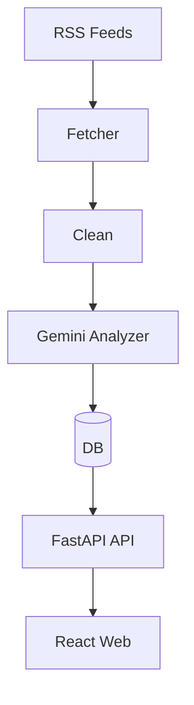
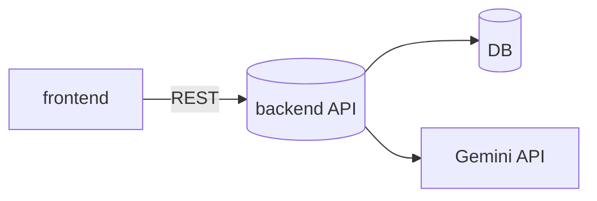

# Rokey News 요약/감성 분석 웹앱

RSS 기반 뉴스를 수집해 Gemini로 요약/감성 분석하고, 웹에서 검색·필터링·열람할 수 있는 서비스입니다. 프런트(Vite+React)와 백엔드(FastAPI)로 구성됩니다.



## 디렉터리 구조
- `backend/` FastAPI 서비스
- `frontend/` Vite+React 웹
- `docs/` 기획·설계 문서
- `.github/workflows/` CI/CD 파이프라인



## 빠른 시작
### 백엔드 (로컬)
```bash
cd backend
python -m venv .venv && .venv/Scripts/activate   # Windows
pip install -r requirements.txt
uvicorn app.main:app --reload --host 0.0.0.0 --port 8000
```
- 헬스체크: http://localhost:8000/health
- 환경변수: `GEMINI_API_KEY`, `DATABASE_URL`(기본 sqlite:///./local.db), `ALLOWED_ORIGINS`, `RSS_SOURCES`, `RATE_LIMIT_PER_MIN`

### 프런트엔드 (로컬)
```bash
cd frontend
npm install
npm run dev
```
- 환경변수: `VITE_API_BASE_URL` (예: `http://localhost:8000`)

### 환경 변수 예시
```bash
# backend
GEMINI_API_KEY=your_gemini_key
DATABASE_URL=sqlite:///./local.db
ALLOWED_ORIGINS=["http://localhost:5173"]
RATE_LIMIT_PER_MIN=60
RSS_SOURCES=[{"name":"Example","url":"https://example.com/rss"}]

# frontend
VITE_API_BASE_URL=http://localhost:8000
```

## 주요 기능
- RSS 수집 및 중복 방지(해시)
- Gemini 기반 요약/감성/키워드 추출
- 기사 목록/검색/감성 필터, 상세 보기
- CI: 프런트 lint/build, 백엔드 pytest
- 배포 옵션(무료 조합 예시)
  - DB: Neon(Postgres)
  - 백엔드: Fly.io Web Service (Docker)
  - 프런트: Cloudflare Pages (정적 사이트)

## API 개요
- `GET /health`
- `GET /articles` (q, sentiment, source, from, to, sort)
- `GET /articles/{id}`
- `GET /articles/{id}/analysis`
- `GET /analyses/{id}`
- `POST /admin/ingest/run` (RSS 수집→요약/감성 분석, 키 없으면 분석 생략)

## 남은 TODO(요약)
- API 라우트 구현: `/articles`, `/analyses`, `/ingest/run`
- DB 세션/마이그레이션(Alembic), 수집→분석 파이프라인 완성
- 입력 정제/PII 필터, 레이트리밋/백오프, 구조화 로그
- 프런트 필터(날짜/출처/정렬) 확장 및 로딩/에러 UX 강화
- `.env.example` 및 상세 API 문서화

## 배포 시크릿
- 공통: `GEMINI_API_KEY`, `DATABASE_URL`, `ALLOWED_ORIGINS`, `RATE_LIMIT_PER_MIN`
- 프런트: `VITE_API_BASE_URL`
- Fly.io: `FLY_API_TOKEN`
- Cloudflare Pages: `CF_API_TOKEN`, `CF_ACCOUNT_ID`

## 참고
- 상세 기획/설계: `docs/requirements.md`, `docs/architecture.md`, `docs/prompt-spec.md`, `docs/frontend-plan.md`, `docs/backend-plan.md`, `docs/ci-cd.md`

